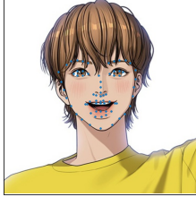
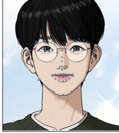
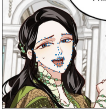
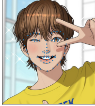
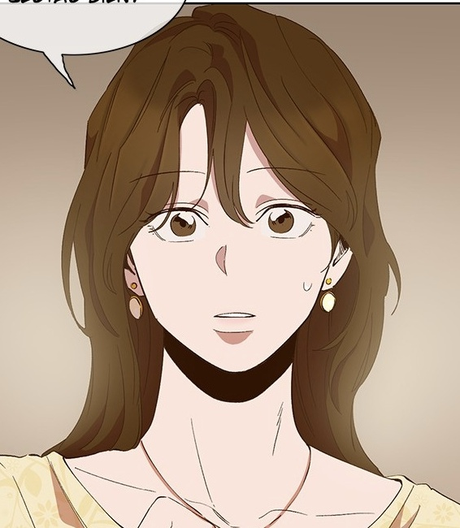
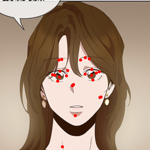

## FFHQ Face Image Alignment

**landmark detector** : 
  1. [`1adrianb/face-alignment`](https://github.com/1adrianb/face-alignment) : `pip install face-alignment`
  2. [`nagadomi/lbpcascade_animeface`](https://github.com/nagadomi/lbpcascade_animeface)
  3. [`kanosawa/anime_face_landmark_detection`](https://github.com/kanosawa/anime_face_landmark_detection)
  
  
**FFHQ alignment** : [NVlabs/ffhq-dataset](https://github.com/NVlabs/ffhq-dataset/blob/master/download_ffhq.py)

**Results**

| original images | alignment images | alignment (no padding) | 
| --- | --- | --- |
|   |  |  |
|   |  |  |
|   |  |  |
|   |  |  |
|   |  |  |

