# FFHQ Face Image Alignment

**landmark detector** : 
  1. [`1adrianb/face-alignment`](https://github.com/1adrianb/face-alignment) : `pip install face-alignment`
  2. [`nagadomi/lbpcascade_animeface`](https://github.com/nagadomi/lbpcascade_animeface)
  3. [`kanosawa/anime_face_landmark_detection`](https://github.com/kanosawa/anime_face_landmark_detection)
  
  
**FFHQ alignment** : [NVlabs/ffhq-dataset](https://github.com/NVlabs/ffhq-dataset/blob/master/download_ffhq.py)


## Result

| original images | Landmark | FFHQ-Alignment | 
| --- | --- | --- |
|   |  |  |
|   |  |  |
|   |  |  |
|   |  |  |
|   |  |  |


---

| landmark-68 | landmark-24 |
| --- | --- |
| 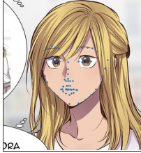 | 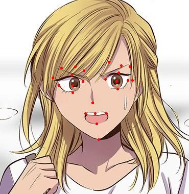</p> |

### Comparision
<p align='center'>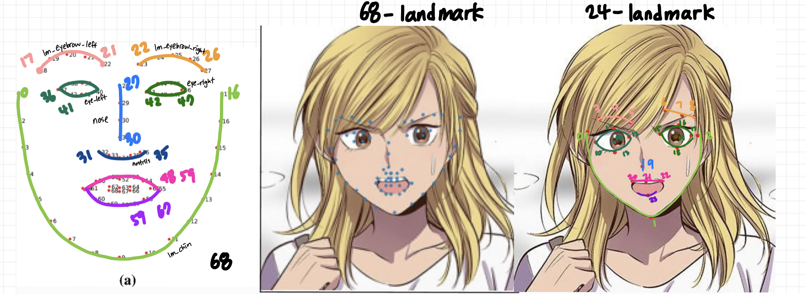</p>

---
### 1. 68 landmark


```python
lm_chin          = lm[0  : 17, :2]  # left-right
lm_eyebrow_left  = lm[17 : 22, :2]  # left-right
lm_eyebrow_right = lm[22 : 27, :2]  # left-right
lm_nose          = lm[27 : 31, :2]  # top-down
lm_nostrils      = lm[31 : 36, :2]  # top-down
lm_eye_left      = lm[36 : 42, :2]  # left-clockwise
lm_eye_right     = lm[42 : 48, :2]  # left-clockwise
lm_mouth_outer   = lm[48 : 60, :2]  # left-clockwise
lm_mouth_inner   = lm[60 : 68, :2]  # left-clockwise

# Calculate auxiliary vectors.
eye_left     = np.mean(lm_eye_left, axis=0)
eye_right    = np.mean(lm_eye_right, axis=0)
eye_avg      = (eye_left + eye_right) * 0.5
eye_to_eye   = eye_right - eye_left
mouth_left   = lm_mouth_outer[0]
mouth_right  = lm_mouth_outer[6]
mouth_avg    = (mouth_left + mouth_right) * 0.5
eye_to_mouth = mouth_avg - eye_avg
```
**Success**

| landmark | ffhq-alignment |
| --- | --- |
| 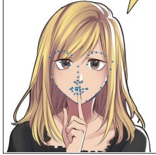 | |

|  |  |  |  |
| --- | --- | --- | --- |
| 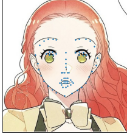 | 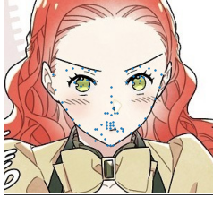 | 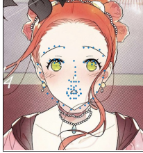 | 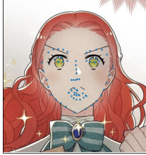 |

---
### 2. 24 landmark

```python
lm = np.array(face_landmarks)
lm_chin          = lm[0  : 3, :2]  # left-right
lm_eyebrow_left  = lm[3  : 6, :2]  # left-right
lm_eyebrow_right = lm[6  : 9, :2]  # left-right
lm_nose          = lm[9  : 10, :2]  # top-down
lm_eye_left      = lm[10 : 15, :2]  # left-clockwise
lm_eye_right     = lm[15 : 20, :2]  # left-clockwise

# Calculate auxiliary vectors.
eye_left     = np.mean(lm_eye_left, axis=0)
eye_right    = np.mean(lm_eye_right, axis=0)
eye_avg      = (eye_left + eye_right) * 0.5
eye_to_eye   = eye_right - eye_left
mouth_left   = lm[20, :2]
mouth_right  = lm[22, :2]
mouth_avg    = (mouth_left + mouth_right) * 0.5
eye_to_mouth = mouth_avg - eye_avg
```


**success**
| landmark | ffhq-alignment |
| --- | --- |
| 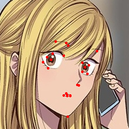 | |
| 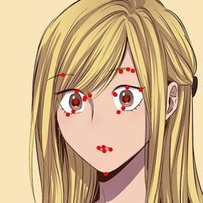 | |


**failure**
| landmark | ffhq-alignment |
| --- | --- |
| 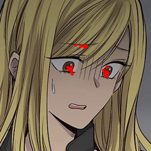 | |
| 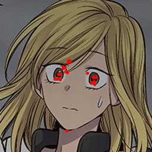 | |
| 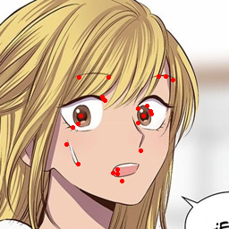 | 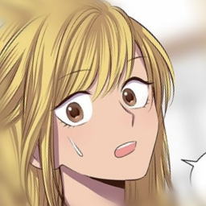|
