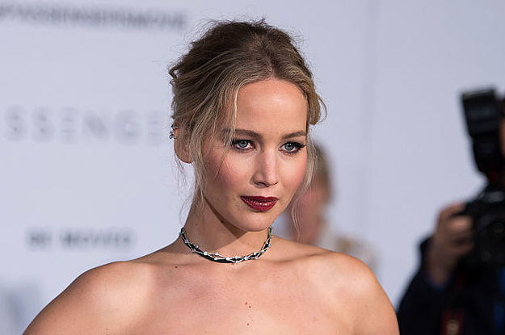
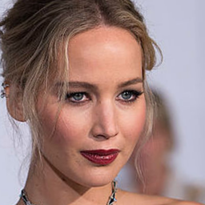
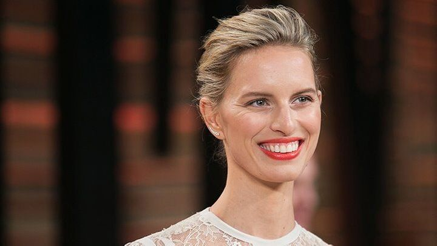
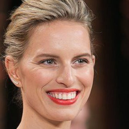
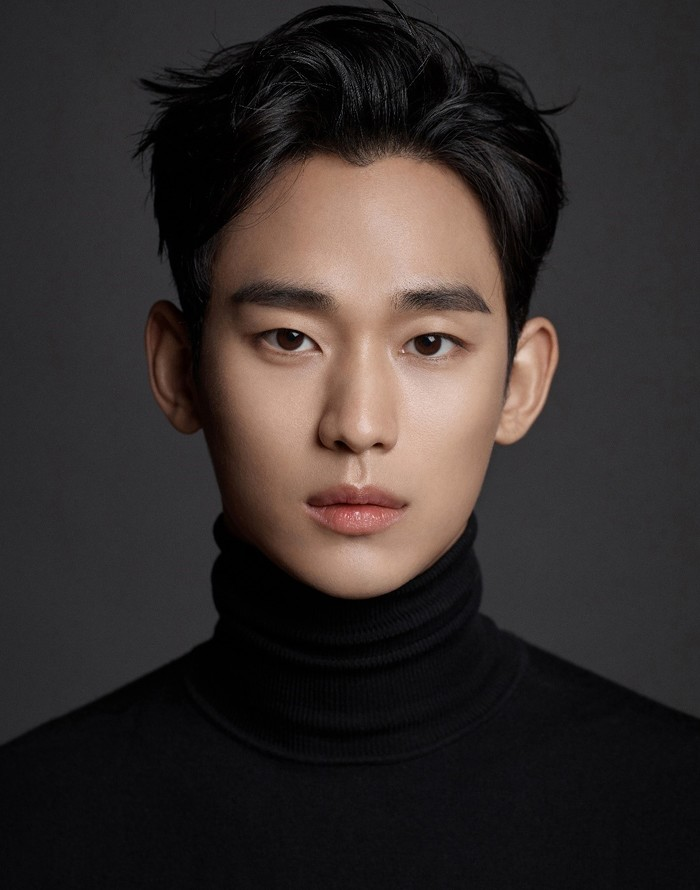
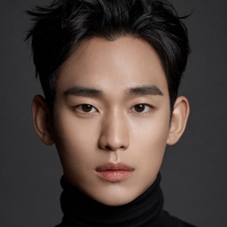

## FFHQ Face Image Alignment


**Install**
```
pip install face-alignment
```

**Usage**

```bash
usage: ffhq-align.py [-h] [-s SRC] [-d DST] [-o OUTPUT_SIZE]
                     [-t TRANSFORM_SIZE] [--no_padding]

A simple script to extract eye and mouth coordinates from a face image.

optional arguments:
  -h, --help            show this help message and exit
  -s SRC, --src SRC     directory of raw images
  -d DST, --dst DST     directory of aligned images
  -o OUTPUT_SIZE, --output_size OUTPUT_SIZE
                        size of aligned output (default: 256)
  -t TRANSFORM_SIZE, --transform_size TRANSFORM_SIZE
                        size of aligned transform (default: 256)
  --no_padding          no padding
```

**Results**

| original images | alignment images | alignment (no padding) | 
| --- | --- | --- |
| <p align='center'></p> |  <p align='center'></p> |  <p align='center'></p> |
| <p align='center'></p> |  <p align='center'></p> |  <p align='center'></p> |
| <p align='center'></p> |  <p align='center'></p> |  <p align='center'></p> |
| <p align='center'></p> |  <p align='center'></p> |  <p align='center'></p> |
| <p align='center'></p> |  <p align='center'></p> |  <p align='center'></p> |
| <p align='center'></p> |  <p align='center'></p> |  <p align='center'></p> |

---

**Reference**

- **landmark detector** : [`1adrianb/face-alignment`](https://github.com/1adrianb/face-alignment)
- **FFHQ alignment** : [NVlabs/ffhq-dataset](https://github.com/NVlabs/ffhq-dataset/blob/master/download_ffhq.py)
  
