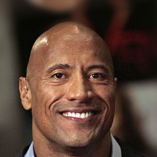
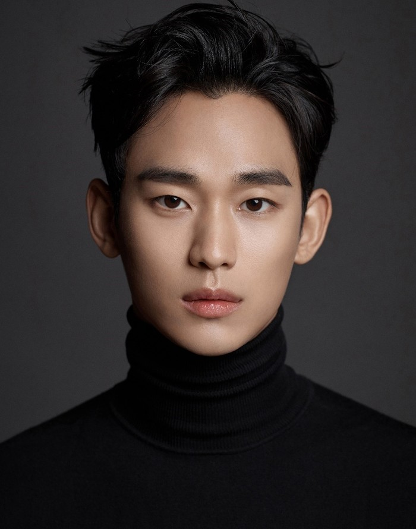
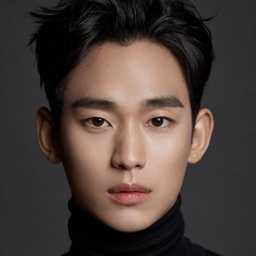
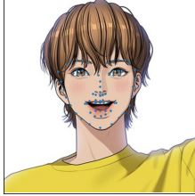
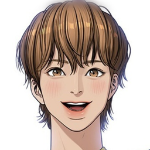
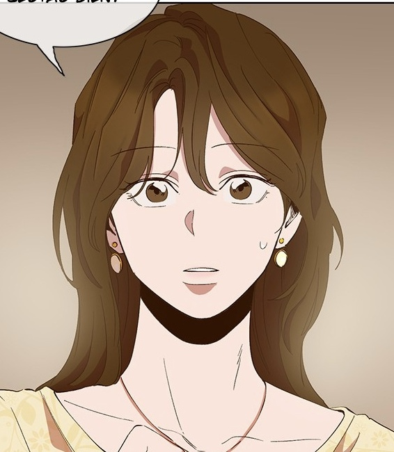

# FFHQ-Alignment

## 1. Face Alignment

| original images | alignment images | alignment (no padding) | 
| --- | --- | --- |
|   |    |    |
|   |    |    |
|   |    |    |
|   |    |    |
|   |    |    |
|   |    |    |

---

## 2. Anime Alignment

| original images | Landmark | FFHQ-Alignment | 
| --- | --- | --- |
|   |  |  |
|   |  |  |
|   |  |  |
|   |  |  |
|   |  |  |

---

## 3. Landmark Detector

 

---

## Reference

**landmark detector** : 
  1. [`1adrianb/face-alignment`](https://github.com/1adrianb/face-alignment) : `pip install face-alignment`
  2. [`nagadomi/lbpcascade_animeface`](https://github.com/nagadomi/lbpcascade_animeface)
  3. [`kanosawa/anime_face_landmark_detection`](https://github.com/kanosawa/anime_face_landmark_detection)
  
**FFHQ alignment** : [NVlabs/ffhq-dataset](https://github.com/NVlabs/ffhq-dataset/blob/master/download_ffhq.py)
